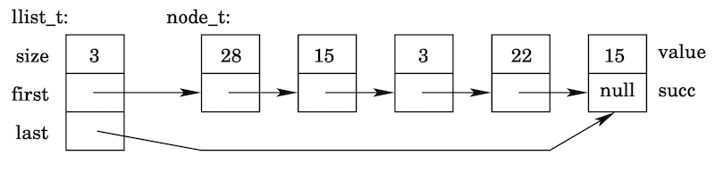

# Zusatzaufgabe 2: Verkettete Liste

Um den Umgang mit Zeigern zu üben, wollen wir die aus der Vorlesung bekannte Liste als verkettete Liste (englisch: *linked list*) von einzelnen Elementen implementieren.

In der Header-Datei deklarieren wir einen unvollstä̈ndigen Datentypen llist t und die Funktionen, mit denen wir auf die Liste zugreifen wollen. Beachten Sie dabei, dass wir den Datentyp node t fü̈r die einzelnen Listenelemente dort nicht angeben. Die verkettete Liste soll die gleichen Operationen bereit stellen, wie die aus der Vorlesung bekannte Liste.